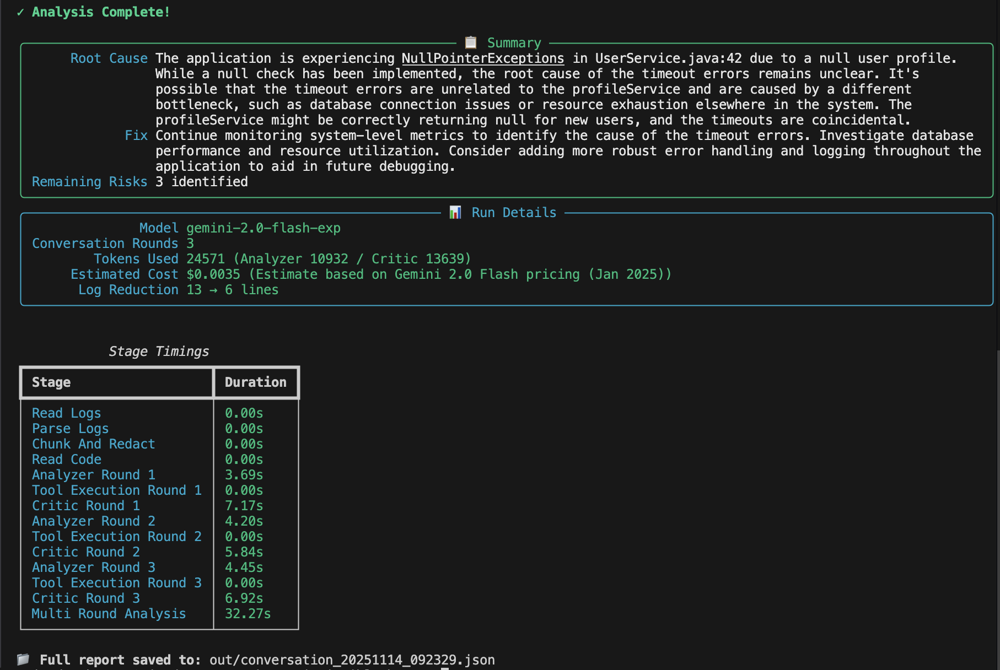

# Multi Large Language Model (LLM) Production Log Debugger

The Multi LLM Production Log Debugger is an incident analysis pipeline for production systems that use large language models. It reads production logs and code snippets, runs Gemini powered Analyzer and Critic agents over them and produces incident reports with evidence, fixes and token or cost metrics.

---

## Key capabilities

- **Multi agent reasoning loop**: the Analyzer agent proposes root cause hypotheses, the Critic agent checks them and both can call shared tools.
- **Tool assisted grounding**: structured log parsing, clustering and chunking, personally identifiable information (PII) redaction and regular expression based code search.
- **LLM cost and observability**: every run records timings, token usage, estimated spend and a full conversation transcript.
- **Dual execution modes**: live text user interface (TUI) streaming for demos and a fully deterministic tools only test mode that avoids live model calls.
- **Gemini first design**: swappable SDK or REST clients and configurable models, limits and pricing in a single YAML configuration file.

---

## Architecture

```
┌──────────┐      ┌────────────────────┐      ┌─────────────────────┐
│   CLI    │ ───▶ │  Orchestrator      │ ───▶ │ Conversation State  │
│ (Typer)  │      │ (engine / router)  │      │  + Tool Router      │
└──────────┘      └────────┬───────────┘      └───────────┬────────┘
                           │                              │
                           │                              │
                           ▼                              ▼
                  ┌────────────────┐            ┌────────────────┐
                  │ Analyzer Agent │            │  Critic Agent  │
                  │  (Gemini SDK)  │            │  (Gemini SDK)  │
                  └────────┬───────┘            └───────┬────────┘
                           │                            │
                           └──────────────┬──────────────┘
                                          │  LLM calls
                                          ▼
                               ┌────────────────────┐
                               │  Gemini API (SDK)  │
                               └─────────┬──────────┘
                                         │
                 ┌───────────────────────┴───────────────────────┐
                 │                    Tools                      │
                 │     parse_logs • grep_error • chunk/redact    │
                 └───────────────────────────────────────────────┘
```

1. **Ingestion**: logs and code are read from disk, logs are parsed and chunked and personally identifiable information (PII) is redacted.
2. **Conversation loop**: the Analyzer agent generates hypotheses and the Critic agent verifies and reports across multiple rounds.
3. **Tooling**: agents call structured tools through function calling for deterministic evidence gathering.
4. **Outputs**: a Markdown incident report, JSON metrics and a JSON conversation trace inside `out/`.

See `ARCHITECTURE.md` for deeper diagrams and agent prompts.

---

## Quick start

### Prerequisites
- Python 3.10 or later
- Google Gemini API key set as `GEMINI_API_KEY` in `.env`

### Clone and configure
```bash
git clone https://github.com/<you>/invincible-bots.git
cd invincible-bots
cp .env.example .env
echo "GEMINI_API_KEY=your_key" >> .env
```

### Option A: Poetry (recommended)
```bash
poetry install
poetry run python -m src.orchestrator.main --help
```

### Option B: pip
```bash
python -m venv .venv && source .venv/bin/activate
pip install -r requirements.txt
python -m src.orchestrator.main --help
```

---

## Configuration

All runtime settings live in `src/config/settings.yaml`:

- `gemini`: backend (`sdk` or `rest`), model, temperature, maximum tokens and pricing metadata.
- `pipeline`: minimum and maximum conversation rounds before the Critic agent can confirm.
- `limits`: log line limits, code character caps and tool result truncation.
- `thresholds`: confidence requirements for a safe exit.
- `output`: destination directory for reports and metrics (`out/`).

Use `--config custom.yaml` on the CLI to load an alternate file.

---

## Usage

### Analyze real incidents
```bash
poetry run python -m src.orchestrator.main analyze \
  samples/logs_npe.txt \
  samples/code/UserService.java \
  samples/code/AuthMiddleware.js
```

Flags:
- `--live`: stream agent turns and tool events through the Rich library.
- `-v` or `--verbose`: print verbose logs to the console.
- `--no-llm`: run parsing and code tools only with no Gemini calls for debugging.
- `-c` or `--config PATH`: point to an alternate YAML configuration file.

### Run the bundled demo
```bash
poetry run python -m src.orchestrator.main demo
```
Creates sample logs and code if they are missing and starts a live session.



### Tools only sanity check
```bash
poetry run python -m src.orchestrator.main analyze \
  logs.txt services/UserService.java --no-llm
```
Outputs a JSON report (`out/tools_test_results.json`) that summarizes parsing, chunking and grep findings.

---

## Project structure

```
src/
├─ orchestrator/     # CLI and pipeline engine, state and tool router
├─ agents/           # Analyzer and Critic implementations and prompts
├─ tools/            # parse_logs and grep_error utilities
├─ utils/            # input or output helpers, configuration loader, chunking, redaction and validators
├─ models/           # Dataclasses such as LogEntry, Hypothesis, ToolCall and IncidentReport
└─ vendors/          # Gemini SDK or REST client wrappers
tests/
└─ unit/             # pytest based coverage for critical utilities
samples/             # Demo logs and companion code snippets
```

---

## Output artifacts

Each successful run writes files into `out/`:

| File | Description |
| --- | --- |
| `report_<timestamp>.md` | Human readable incident report from the Critic agent |
| `metrics_<timestamp>.json` | Timings, token usage, estimated cost and chunking info |
| `conversation_<timestamp>.json` | Full Analyzer, Critic and tool transcript for audits |
| `tools_test_results.json` | Tools only mode summary of parsers and grep results |
| `run.log` | Rolling Rich and standard logging output |

---

## Testing

```bash
poetry run pytest

# or a targeted suite
poetry run pytest tests/unit/test_parse_logs.py
```

For environments without Poetry, activate your virtual environment and run `python -m pytest`.

---

## Roadmap

1. **Real time streaming**: tail logs and pipelines instead of using static files.
2. **Semantic code search**: replace regular expression based grep with vector search tools.
3. **Memory and lessons learned**: store resolved incidents to speed up future runs.
4. **PagerDuty and Slack hooks**: send summarized reports to on call responders.

---

## Contributing

1. Fork and branch (`git checkout -b feature/foo`).
2. Run formatting and tests.
3. Submit a pull request that documents the change and links any demo artifacts.

Open issues for bugs or feature requests.
